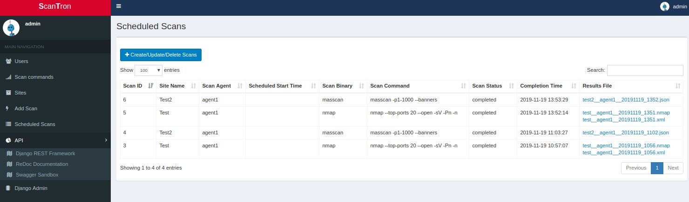
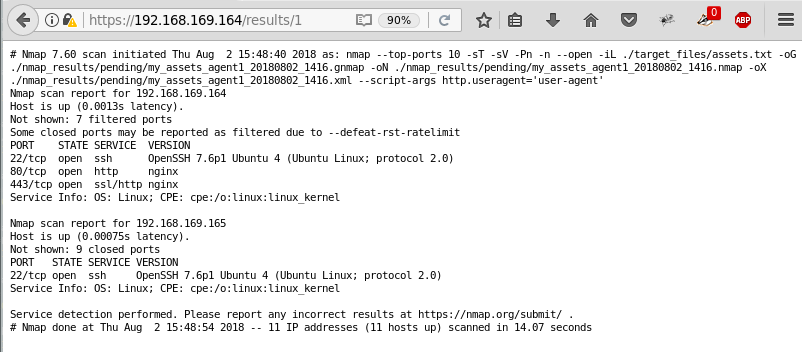
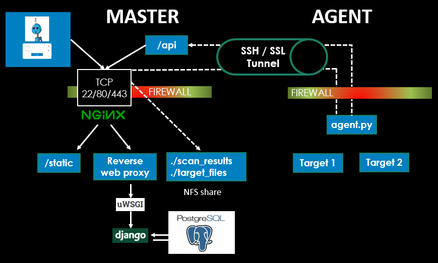
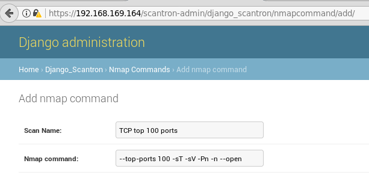
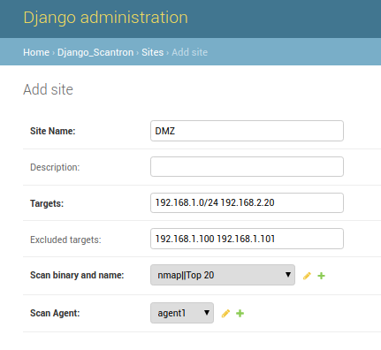
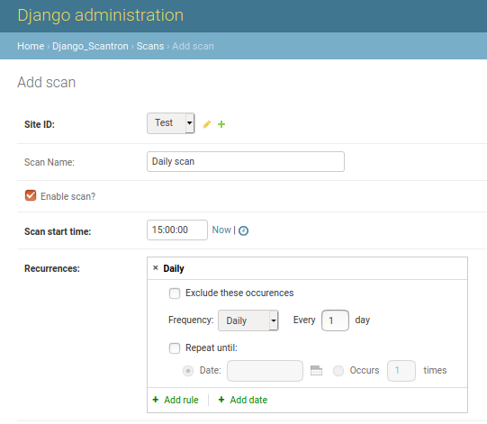
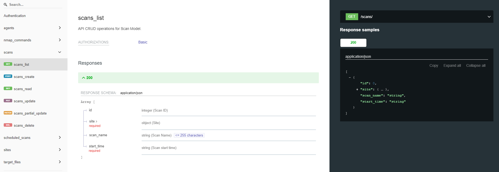
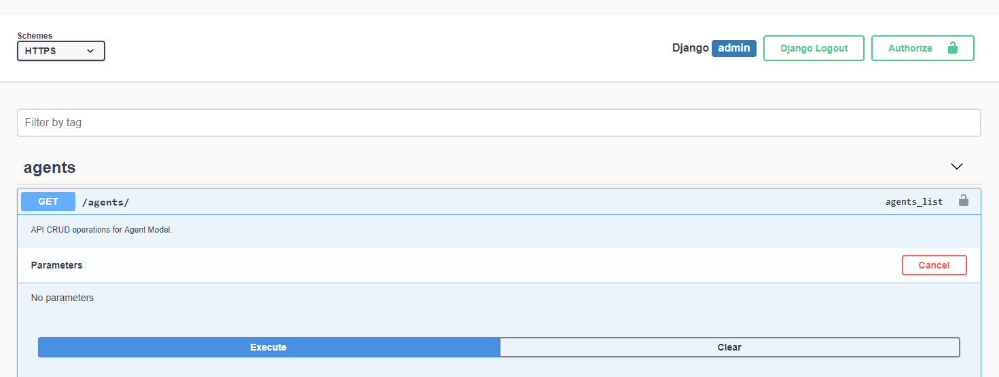

# Scantron


<p align="left">
<a href=""></a>
<a href="https://github.com/ambv/black"></a>
</p>

## Overview

Scantron is a distributed nmap and masscan scanner comprised of two components.  The first is a console node that
consists of a web front end used for scheduling scans and storing nmap scan targets and results.  The second component
is an engine that pulls scan jobs from the console and conducts the actual nmap scanning.  A majority of the
application's logic is purposely placed on the console to make the engine(s) as "dumb" as possible.  All nmap target
files and nmap results reside on the console and are shared through a network file share (NFS) leveraging SSH tunnels.
The engines call back to the console periodically using a REST API to check for scan tasks and provide scan status
updates.

Checkout the Python [Scantron API client](https://github.com/rackerlabs/scantron/tree/master/scantron_api_client) for
interacting with the Scantron API and driving automated workflows.



Scantron is coded for Python3.6+ exclusively and leverages Django for the web front-end, Django REST Framework as the
API endpoint, PostgreSQL as the database, a Redis job queue for tasks, Postfix for email scan alerts, and comes complete
with Ubuntu-focused Ansible playbooks for smooth deployments.  Scantron has been tested on Ubuntu 18.04 and may be
compatible with other operating systems.  Scantron's inspiration comes from:

* [dnmap](https://sourceforge.net/projects/dnmap/)
* [Minions](https://github.com/sixdub/Minions)
* [rainmap svn](https://svn.nmap.org/rainmap/) / [rainmap github](https://github.com/axtl/rainmap)
* [rainmap-lite](https://github.com/cldrn/rainmap-lite)



Scantron relies heavily on utilizing SSH port forwards (-R / -L) as an umbilical cord to the engines.  Either an SSH
connection from `console --> engine` or `engine --> console` is acceptable and may be required depending on different
firewall rules, but tweaking the port forwards and autossh commands will be necessary.  If you are unfamiliar with these
concepts, there are some great overviews and tutorials out there:

* <https://help.ubuntu.com/community/SSH/OpenSSH/PortForwarding>
* <https://www.systutorials.com/39648/port-forwarding-using-ssh-tunnel/>
* <https://www.everythingcli.org/ssh-tunnelling-for-fun-and-profit-autossh/>

## Use cases

Scantron is not engineered to be quickly deployed to a server to scan for a few minutes, then torn down and destroyed.  
It's better suited for having a set of static scanners (e.g., "internal-scanner", "external-scanner") with a relatively
static set of assets to scan.  A [Scantron API client](https://github.com/rackerlabs/scantron/tree/master/scantron_api_client)
is also available for creating, retrieving, updating, or deleting sites, scan commands, scans, etc.

## Architecture Diagram



## Hardware Requirements

* Engine: If you plan on compiling masscan on an engine, you'll need at least 1024 MB of memory.  It fails to build with
only 512 MB.  If you do not want to build masscan, set `install_masscan_on_engine` to `False` in
`ansible-playbooks/group_vars/all`

* Console: 512 MB of memory was the smallest amount successfully tested, however, if you plan on processing large scan
files (using the scripts found in `console/scan_results`: `masscan_json_to_csv.py`, `nmap_to_csv.py` or
`xml_to_json_nmap_results.py`), you'll need more memory.

## Ansible Deployment Server and Initial Setup

This is your local box, preferably Linux.  Ansible >= 2.4.0.0 is the minimum version required for utilizing ufw comments.

Clone the project and execute `initial_setup.sh`.

```bash
# Clone scantron project.
git clone https://github.com/rackerlabs/scantron.git
cd scantron
./initial_setup.sh  # Run as non-root user.
```

## Installation

Installation requires a general knowledge of Python, pip, and Ansible.  Every attempt to make the deployment as simple
as possible has been made.

### Cloud Provider Caveats

#### NAT'd instances

If the console server is actually a RFC1918 IP and not the public IP (because of NAT), the NAT'd RFC1918 IP
(e.g., 10.1.1.2) will have to be added to the `ALLOWED_HOSTS` in
`ansible-playbooks/roles/console/templates/production.py.j2`

This is common in AWS and GCP environments.

#### IBM Cloud

Per <https://github.com/0xtavian>:  For the Ansible workload to work on IBM Cloud, edit the file `/boot/grub/menu.lst`
by changing

```bash
# groot=LABEL...
```

to

```bash
# groot=(hd0)
```

### Update hosts

Edit the hosts in this file:

* `ansible-playbooks/hosts`

### Console Installation

The recommendation is to deploy the console first.  

#### Update Console Ansible Variables

Edit any variables in these files before running playbook:

* `ansible-playbooks/group_vars/all`
  
If you plan on utilizing the same API key across all engines (not recommended, but easier for automated deployments),
change `utilize_static_api_token_across_engines` to `True`.  This prevents you from having to log into each engine and
update `engine_config.json` with the corresponding API key.  The `group_vars/static_api_key` will be created by the
the console ansible playbook.  The Ansible engine playbook will autofill the `engine_config.json.j2` template with the
API key found in `group_vars/static_api_key`.

**WARNING**: The `engine_config.json.j2` will generate a random `scan_engine` (e.g., `engine-847623`), so if you deploy
more than 1 engine, you won't run into complications with engine name collisions.  You will, however, need to add create
the user on the console, since the console returns scheduled jobs to the engine based off the engine's name!

Rename `console/scantron_secrets.json.empty` to `console/scantron_secrets.json` (should be done for you by
`initial_setup.sh`)

#### Update Console Secrets Variables

Update all the values `console/scantron_secrets.json` if you do not like ones generated using `initial_setup.sh`.  Only
the `production` values are used.

* All Scantron Django passwords have a minimum password length of 12.

* For the "SECRET_KEY", per Django's
[documentation](<https://docs.djangoproject.com/en/2.0/howto/deployment/checklist/#secret-key>): The secret key must be
a large random value and it must be kept secret.

#### Change scantron user password (optional)

The `scantron` operating system user password is not really leveraged and is populated by providing a salted hash of a
random password generated using Python's `passlib` library.  If you want to change the password, you will have to
generate a hash for the desired password and update the `temp_user_pass` variable in
`scantron/ansible-playbooks/roles/add_users/vars/main.yml`.

```python
pip3 install passlib

python3 -c "from passlib.hash import sha512_crypt; import getpass; print(sha512_crypt.encrypt(getpass.getpass()))"
```

#### Execute Console Ansible Playbook

Ensure you have a SSH key (or username/password) to access the console box, specified by `--private-key` in the Ansible
command.  User must also have password-less sudo privileges.

```bash
cd ansible-playbooks

# non-root user with password-less sudo capabilities.
ansible-playbook console.yml -u ubuntu --become --private-key=<engine SSH key>

# root user.
ansible-playbook console.yml -u root --private-key=<engine SSH key>
```

#### Change Django user passwords with manage.py (optional)

cd into the console directory `scantron/console` and run the following to change the `admin` (or whatever user needs
their password changed) user password.

```bash
python3 manage.py changepassword admin
```

### Engine Installation

#### Update Engine Ansible Variables

Edit any variables in these files before running playbook:

* `ansible-playbooks/group_vars/all`
* `ansible-playbooks/roles/engine/vars/main.yml`

#### Ensure proper user permissions

Ensure you have a SSH key (or username/password) to access the engine box, specified by `--private-key` in the Ansible
command.  The user **must** also have password-less sudo privileges.  If you are creating the boxes on AWS, then the
user is `ubuntu` for Ubuntu distros and the user already has password-less sudo capabilities.  If you need to add
password-less sudo capability to a user, create a `/etc/sudoder.d/<USERNAME>` file, where `<USERNAME>` is the actual
user, and populate it with:

```bash
<USERNAME> ALL=(ALL) NOPASSWD: ALL
```

SSH-ing in as `root` will also work for the Ansible deployment, but is not generally recommended.

#### Execute Engine Ansible Playbook

```bash
cd ansible-playbooks

# non-root user with password-less sudo capabilities.
ansible-playbook engine.yml -u ubuntu --become --private-key=<engine SSH key>

# root user.
ansible-playbook engine.yml -u root --private-key=<engine SSH key>
```

## Adding additional engines

A Scantron engine is synonymous with a user.

```none
engines <--> users
```

Users / engines are added through the webapp, so once a user / engine is added, an API token is automatically generated
for that user / engine.  The user's / engine's password is not necessary for Scantron to function since all user /
engine authentication is done using the API token.  The username and password can be used to login to the webapp to test
API functionality.  More API testing information can be found in the **Test Engine API** section of this README.

### Update /etc/rc.local with engine IPs for autossh

This is done automatically for one engine through Ansible.  You may have to add additional lines and update SSH keys for
each engine if they are different.  These commands are for the console connecting to the engines.  

In this example:

* console - 192.168.1.99
* engine1 - 192.168.1.100
* engine2 - 192.168.1.101

```bash
# console --> engine 1
su - autossh -s /bin/bash -c 'autossh -M 0 -f -N -o "StrictHostKeyChecking no" -o "ServerAliveInterval 60" \
    -o "ServerAliveCountMax 3" -p 22 -R 4430:127.0.0.1:443 -R 2049:127.0.0.1:2049 \
    -i /home/scantron/console/autossh.key autossh@192.168.1.100'

# console --> engine 2
su - autossh -s /bin/bash -c 'autossh -M 0 -f -N -o "StrictHostKeyChecking no" -o "ServerAliveInterval 60" \
    -o "ServerAliveCountMax 3" -p 22 -R 4430:127.0.0.1:443 -R 2049:127.0.0.1:2049 \
    -i /home/scantron/console/autossh.key autossh@192.168.1.101'
```

If the console cannot SSH to an engine, then the autossh command will be run on the engine and the port forwards will be
local (`-L`) instead of remote (`-R`).

```bash
# console <-- engine 1
su - autossh -s /bin/bash -c 'autossh -M 0 -f -N -o "StrictHostKeyChecking no" -o "ServerAliveInterval 60" \
    -o "ServerAliveCountMax 3" -p 22 -L 4430:127.0.0.1:443 -L 2049:127.0.0.1:2049 \
    -i /home/scantron/console/autossh.key autossh@192.168.1.99'
```

## Engines

### Engine's engine_config.json

engine_config.json is a configuration file used by engines to provide basic settings and bootstrap communication with
the console.  Each engine can have a different configuration file.  

```none
The "api_token" will have to be modified on all the engines after deploying the console!
```

Engine settings:

**scan_engine:** Name of the engine.  This name is also used in the engine's HTTP `User-Agent` string to help identify
engines calling back in the nginx web logs.

**api_token:** Used to authenticate engines.  Recommend different API Tokens per engine, but the same one could be used.

**console_address:** Web address of the console.  Could be 127.0.0.1 if engine traffic is tunneled to the console
through an SSH port forward.

**console_port:** Web port the console is listening on.

**callback_interval_in_seconds:** Number of seconds engines wait before calling back for scan jobs.

**number_of_threads:** Number of threads used to execute/kill scan jobs.

**target_files_dir:** Name of actual engine `target_files` directory on the engine box.

**scan_results_dir:** Name of actual engine `scan_results` directory on the engine box.

**log_verbosity:** Desired log level for logs/engine.log

```bash
# Level     Numeric value
# CRITICAL  50
# ERROR     40
# WARNING   30
# INFO      20
# DEBUG     10
```

**http_useragent:** HTTP User-Agent used instead of nmap's default
`Mozilla/5.0 (compatible; Nmap Scripting Engine; https://nmap.org/book/nse.html)`.

**supported_scan_binaries** Experimental.  Supported scan binaries advertised by the engine.

### Standalone Engine Binary

This repo also contains a stand-alone binary `engine/engine` that can be used for the engine.  This
allows for a quicker deployment if managing the Python environment is difficult or cumbersome.  The basic requirements
are:

* nmap and masscan must exist on the system
* the `engine_config.json` file exists
* An SSH tunnel to/from the console still exists to read target files and write scan results

#### Creating the standalone binary

The standalone binaries can be generated on a local box.

```bash
cd engine
virtualenv -p python3.6 .venv
source .venv/bin/activate
pip install pyinstaller
pyinstaller --onefile engine.py --name engine
mv dist/engine .

./engine -v > standalone_engine_binary.txt
echo -e "MD5     `md5sum engine`" >> standalone_engine_binary.txt
echo -e "SHA-256 `sha256sum engine`" >> standalone_engine_binary.txt

rm -rf __pycache__ build dist engine.spec .venv
```

### Engine Execution

Update all the engines' engine_config.json files with their respective `api_token` for the engine by logging in as
`admin` and browsing to `https://<HOST>/scantron-admin/authtoken/token` to see the corresponding API token for each
user / engine.

#### Option 1: Run engine as a service

Enable scantron-engine service at startup.

```bash
systemctl daemon-reload  # Required if scantron-engine.service changed.
systemctl enable scantron-engine
```

Disable scantron-engine service at startup.

```bash
systemctl disable scantron-engine
```

Scantron service troubleshooting commands.

```bash
systemctl status scantron-engine
systemctl start scantron-engine
systemctl stop scantron-engine
systemctl restart scantron-engine
```

#### Option 2: Run engine as standalone script

Use `screen` to avoid the script dying after disconnecting through SSH.

```bash
screen -S engine1  # Create a screen session and name it engine1, if using screen.

cd engine
source .venv/bin/activate
python engine.py -c engine_config.json

CTRL + a + d  # Break out of screen session, if using screen.
screen -ls  # View screen job, if using screen.

screen -r engine1  # Resume named screen session, if using screen.
```

### Engine Troubleshooting

Verify SSH connection from the console with reverse port redirect is up on each engine.  Any traffic hitting
127.0.0.1:4430 will be tunneled back to the console.  This port is for communicating with the API.  Any traffic hitting
127.0.0.1:2049 will connect back to the NFS share on the console.

```bash
tcp    0    0 127.0.0.1:4430    0.0.0.0:*    LISTEN    1399/sshd: autossh
tcp    0    0 127.0.0.1:2049    0.0.0.0:*    LISTEN    1399/sshd: autossh
```

Check each engine's root crontab to ensure `nfs_watcher.sh` is being run every minute.

```bash
crontab -l -u root
```

### Test Engine API

If you need to test the API without running the engine, ensure there is a 'pending' scan set to start earlier than the
current date and time.  The server only returns scan jobs that have a 'pending' status and start datetime earlier than
the current datetime.

```bash
# Not using SSH tunnels.
curl -k -X GET -H 'Authorization: Token <VALID API TOKEN>' https://192.168.1.99:443/api/scheduled_scans

# Using SSH tunnels.
curl -k -X GET -H 'Authorization: Token <VALID API TOKEN>' https://127.0.0.1:4430/api/scheduled_scans
```

You can also log into the webapp using the engine name and password and browse to `/api/?format=json` to view any scan
jobs.  The username and engine name are the same from the webapp's point of view.

## Console

### Console `target_files` Folder

* Place files with target IPs/hosts (fed to nmap `-iL` switch) in `console/target_files/`
* `target_files` is an NFS share on the console that the engine reads from through an SSH tunnel.

### Console `scan_results` folder

* nmap scan results from engines go here.
* `console/scan_results/` is an NFS share on the console that the engine writes to through an SSH tunnel.

### Console Troubleshooting

1). Ensure SSH tunnels setup in `/etc/rc.local` are up.

```bash
netstat -nat | egrep "192.168.1.100|192.168.1.101"
ps -ef | egrep autossh
```

2). Django logs can be found here: `/var/log/webapp/django_scantron.log`

3). Check nginx logs for engine name in User-Agent field to determine which engines are calling home.
nginx logs: `tail -f /var/log/nginx/{access,error}.log`

4). uwsgi logs: `/home/scantron/console/logs`

### Known issues with the console NFS share

If you need to reboot a box, do it with the provided `clean_reboot.sh` script that will stop all relevant services.
Without stopping the `nfs-kernel-server` service gracefully, sometimes the OS will hang and get angry.

## Email Alerts

A vanilla Postfix instance is installed on the console that can be used to send email alerts when a scan starts, errors
out, or finishes.  Email settings and credentials are kept in the `scantron_secrets.json` file.  Out of the box, most
mail will likely be marked as spam/junk.  The recommendation is to use a credentialed account to send email alerts to
users.

## Miscellaneous

### Updating nmap version

Ubuntu's nmap version pulled using `apt` is fairly out-of-date and the recommendation for Scantron's engines is to pull
the latest version.

For RPM-based Distributions, the latest `.rpm` packages can be found here <https://nmap.org/dist/?C=M&O=D>.  However,
for Debian-based distributions, you must utilize `alien` to convert the `.rpm` to a `.deb` file
<https://nmap.org/book/inst-linux.html> or compile from source.  Recommend going down the `alien` route before compiling
from source.

#### alien

```bash
VERSION=7.70-1  # CHANGE THIS TO LATEST VERSION

apt install alien -y
wget https://nmap.org/dist/nmap-$VERSION.x86_64.rpm
alien nmap-$VERSION.x86_64.rpm

apt remove nmap -y
apt remove ndiff -y
dpkg --install nmap_*.deb
```

#### Compile nmap from source

Another option is to compile nmap from source.  This is dynamically compiled and must be done on the box where nmap is
going to be run from.  Note that past experience had a compiled nmap version returning a different banner than the
provided apt version...so your mileage may vary.

```bash
VERSION=7.70-1  # CHANGE THIS TO LATEST VERSION

wget https://nmap.org/dist/nmap-$VERSION.tar.bz2
bzip2 -cd nmap-$VERSION.tar.bz2 | tar xvf -
cd nmap-$VERSION
./configure --without-ncat --without-ndiff --without-nmap-update --without-nping --without-subversion \
--without-zenmap --with-libdnet=included --with-libpcap=included --with-libpcre=included
make
./nmap -V
```

### Get nmap --top-ports

This provides a list of the actual ports being scanned when the `--top-ports` option is used:

```bash
# TCP
nmap -sT --top-ports 1000 -v -oG -

# UDP
nmap -sU --top-ports 1000 -v -oG -
```

Sorted list based on frequency.

```bash
# TCP sorted list based on frequency.
egrep /tcp /usr/share/nmap/nmap-services | sort -r -k3

# UDP sorted list based on frequency.
egrep /udp /usr/share/nmap/nmap-services | sort -r -k3
```

Source: <https://security.stackexchange.com/questions/78618/is-there-a-nmap-command-to-get-the-top-most-common-ports>

## nmap_port_range_carver

A standalone [script](https://github.com/rackerlabs/scantron/tree/master/nmap_port_range_carver)
 to carve out a range of the top TCP/UDP ports according to the nmap-services file.

This is useful
when:

1. You want to scan a subset of the ports specified in `--top-ports`, say the 10th through 20th top TCP ports, but not
the 1st or 9th ports.

2. You want the 1337th ranked TCP port.

3. You want to utilize nmap to scan **both** TCP and UDP, but not scan the same number of top ports.

    This works and will scan the top 10 ports for BOTH TCP and UDP

    ```bash
    nmap --top-ports 10 -sU -sT <TARGET>
    ```

    but you can't only scan the top 20 TCP and top 10 UDP ports using `--top-ports`.

## Workflow

1. Create user/engine.  By default, Ansible creates `engine1`.

    

2. Create scan command

    

3. Create a site

    * IPs, IP subnets, and FQDNs are allowed.
    * IP ranges (`192.168.1.0-10`) are not currently supported.
    * The targets and excluded_targets are validated using `console/extract_targets.py`, which can also be used as a
      stand alone script.

    

4. Create scan
    * Select start time
    * Add start date
    * Add recurrence rules (if applicable)

    The `/home/scantron/console/scan_scheduler.sh` cronjob checks every minute to determine if any scans need to be
    queued.  If scans are found, it schedules them to be picked up by the engines.

    

5. View currently executing scan results

    ```bash
    cd /home/scantron/console/scan_results/pending
    ls -lart
    ```

    Completed scans are moved to the `/home/scantron/console/scan_results/completed` directory.

6. Process scans

    Scan files are moved between a few folders.

    `/home/scantron/console/scan_results/pending` - Pending scan files from engines are stored here before being moved
    to `scan_results/complete`

    `/home/scantron/console/scan_results/complete` - Completed scan files from engines are stored here before being
    processed by `nmap_to_csv.py`

    The `scantron` user executes a cron job (`nmap_to_csv.sh` which calls `nmap_to_csv.py`) every 5 minutes that will
    process the `.xml` scan results found in the `complete` directory and move them to the `processed` directory.

    `/home/scantron/console/scan_results/processed` - nmap scan files already processed by `nmap_to_csv.py` reside here.

    `/home/scantron/console/for_bigdata_analytics` - .csv files for big data analytics ingestion if applicable

## Scantron API Client

Checkout the Python [Scantron API client](https://github.com/rackerlabs/scantron/tree/master/scantron_api_client) for
interacting with the Scantron API and driving automated workflows.

## API Documentation

There are 3 ways to explore and play around with the API.  The first is the Django REST Framework view:


You can also dig through the API documentation using ReDoc:



Lastly, you can interact with the API using Swagger:



## Database Model Graph

Generated using `django-extensions`'s graph_models.


## Contributing

If you would like to contribute, please adhere to the Python code black formatter rules specifying a line length of 120.

More information about black can be found here (<https://github.com/ambv/black>)

## Robot Image

Robot lovingly delivered by Robohash.org (<https://robohash.org>)
