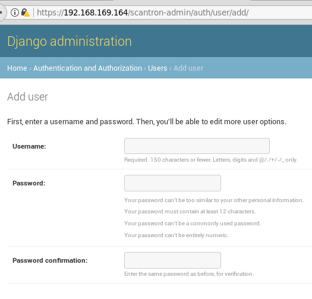

# Scantron


## Overview

Scantron is a distributed nmap scanner comprised of two components.  The first is a master node that consists of a web front end used for scheduling scans and storing nmap scan targets and results.  The second component is an agent that pulls scan jobs from master and conducts the actual nmap scanning.  A majority of the application's logic is purposely placed on master to make the agent(s) as "dumb" as possible.  All nmap target files and nmap results reside on master and are shared through a network file share (NFS) leveraging SSH tunnels.  The agents call back to master periodically using a REST API to check for scan tasks and provide scan status updates.


Scantron is coded for Python3.6+ exclusively and leverages Django for the web front-end, Django REST Framework as the API endpoint, PostgreSQL as the database, and comes complete with Ubuntu-focused Ansible playbooks for smooth deployments.  Scantron has been tested on Ubuntu 18.04 and may be compatible with other operating systems.  Scantron's inspiration comes from:

* [dnmap](https://sourceforge.net/projects/dnmap/)
* [Minions](https://github.com/sixdub/Minions)
* [rainmap svn](https://svn.nmap.org/rainmap/) / [rainmap github](https://github.com/axtl/rainmap)
* [rainmap-lite](https://github.com/cldrn/rainmap-lite)


Scantron relies heavily on utilizing SSH port forwards (-R / -L) as an umbilical cord to the agents.  Either an SSH connection from `master --> agent` or `agent --> master` is acceptable and may be required depending on different firewall rules, but tweaking the port forwards and autossh commands will be necessary.  If you are unfamiliar with these concepts, there are some great overviews and tutorials out there:

* <https://help.ubuntu.com/community/SSH/OpenSSH/PortForwarding>
* <https://www.systutorials.com/39648/port-forwarding-using-ssh-tunnel/>
* <https://www.everythingcli.org/ssh-tunnelling-for-fun-and-profit-autossh/>

## Architecture Diagram


## Ansible Deployment Server and Initial Setup

This is your local box, preferably Linux.  Ansible >= 2.4.0.0 is the minimum version required for utilizing ufw comments.

Clone the project and execute `initial_setup.sh`.

```bash
# Clone scantron project.
git clone https://github.com/rackerlabs/scantron.git
cd scantron
./initial_setup.sh  # Run as non-root user.
```

This is what `initial_setup.sh` does.

Provide pastable to install python3-pip if it already isn't

```bash
sudo apt update && sudo apt install python3-pip -y
```

Install Ansible using pip.

```bash
pip3 install ansible\>=2.4.0.0
```

Generate a passphrase-less SSH key pair for the autossh user.

```bash
ssh-keygen -b 4096 -t rsa -f autossh -q -N ""
```

Move public key to the respective location for Ansible.

```bash
mv autossh.pub ansible-playbooks/roles/agent/files/autossh.pub
```

Move and rename private key to the respective location for Ansible.

```bash
mv autossh master/autossh.key
```

Create empty scantron_secrets.json from scantron_secrets.json.empty.

```bash
cp master/scantron_secrets.json.empty master/scantron_secrets.json
```

## Installation

Installation requires a general knowledge of Python, pip, and Ansible.  Every attempt to make the deployment as simple as possible has been made.

### Cloud Provider Caveats

#### IBM Cloud

Per <https://github.com/0xtavian>:  For the Ansible workload to work on IBM Cloud, edit the file `/boot/grub/menu.lst` by changing

```bash
# groot=LABEL...
```

to

```bash
# groot=(hd0)
```

### Update hosts

Edit the hosts in this file:

* `ansible-playbooks/hosts`

### Agent Installtion

#### Update Agent Ansible Variables

The recommendation is to deploy the agents first.  Edit any variables in these files before running playbook:

* `ansible-playbooks/group_vars/all`
* `ansible-playbooks/roles/agent/vars/main.yml`

#### Ensure proper user permissions

Ensure you have a SSH key (or username/password) to access the agent box, specified by `--private-key` in the Ansible command.  The user **must** also have password-less sudo privileges.  If you are creating the boxes on AWS, then the user is `ubuntu` for Ubuntu distros and the user already has password-less sudo capabilities.  If you need to add passwordless-sudo capability to a user, create a `/etc/sudoder.d/<USERNAME>` file, where `<USERNAME>` is the actual user, and populate it with:

```bash
<USERNAME> ALL=(ALL) NOPASSWD: ALL
```

SSH-ing in as `root` will also work for the Ansible deployment, but is not generally recommended.

#### Execute Agent Ansible Playbook

```bash
cd ansible-playbooks

# non-root user with password-less sudo capabilities.
ansible-playbook agent.yml -u ubuntu --become --private-key=<agent SSH key>

# root user.
ansible-playbook agent.yml -u root --private-key=<agent SSH key>
```

### Master Installation

#### Update Master Ansible Variables

Rename `master/scantron_secrets.json.empty` to `master/scantron_secrets.json` (should be done for you by `initial_setup.sh`)

All Scantron Django passwords have a minimum password length of 12.

For the "SECRET_KEY", per Django's [documentation](<https://docs.djangoproject.com/en/2.0/howto/deployment/checklist/#secret-key>):    The secret key must be a large random value and it must be kept secret.

Populate all the values `master/scantron_secrets.json`, except the `local` key, unless you know what you are doing to test Django.  Only the `production` values are used.

#### Change scantron user password (optional)

The `scantron` user password is not really leveraged and is populated by providing a salted hash of a random password generated using Python's `passlib` library.  If you want to change the password, you will have to generate a hash for the desired password and update the `temp_user_pass` variable in `scantron/ansible-playbooks/roles/add_users/vars/main.yml`.

```python
pip install passlib  # or pip3

python -c "from passlib.hash import sha512_crypt; import getpass; print(sha512_crypt.encrypt(getpass.getpass()))"  # or python3
```

#### Execute Master Ansible Playbook

Ensure you have a SSH key (or username/password) to access the Master box, specified by `--private-key` in the Ansible command.  User must also have password-less sudo privileges.

```bash
cd ansible-playbooks

# non-root user with password-less sudo capabilities.
ansible-playbook master.yml -u ubuntu --become --private-key=<agent SSH key>

# root user.
ansible-playbook master.yml -u root --private-key=<agent SSH key>
```

Ensure the uwsgi.service starts after a reboot:

```bash
systemctl status uwsgi
```

The Ansible playbook creates a symbolic link for the uWSGI service configuration file (`/home/scantron/master/uwsgi.service` --> `/lib/systemd/system/uwsgi.service`)

but an actual file may be necessary:

```bash
cp /home/scantron/master/uwsgi.service /lib/systemd/system/uwsgi.service
```

## Adding additional agents

A Scantron agent is synonymous with a user.

    Agents <--> Users

Users / agents are added through the webapp, so once a user / agent is added, an API token is automatically generated for that user / agent.  The user's / agent's password is not necessary for Scantron to function since all user / agent authentication is done using the API token.  The username and password can be used to login to the webapp to test API functionality.  More API testing information can be found in the **Test Agent API** section of this README.

### Update /etc/rc.local with agent IPs for autossh

This is done automatically for one agent through Ansible.  You may have to add additional lines and update SSH keys for each agent if they are different.  These commands are for master connecting to the agents.  

In this example:

* Master - 192.168.1.99
* agent1 - 192.168.1.100
* agent2 - 192.168.1.101

```bash
# Master --> Agent 1
su - autossh -s /bin/bash -c 'autossh -M 0 -f -N -o "StrictHostKeyChecking no" -o "ServerAliveInterval 60" -o "ServerAliveCountMax 3" -p 22 -R 4430:127.0.0.1:443 -R 2049:127.0.0.1:2049 -i /home/scantron/master/autossh.key autossh@192.168.1.100'

# Master --> Agent 2
su - autossh -s /bin/bash -c 'autossh -M 0 -f -N -o "StrictHostKeyChecking no" -o "ServerAliveInterval 60" -o "ServerAliveCountMax 3" -p 22 -R 4430:127.0.0.1:443 -R 2049:127.0.0.1:2049 -i /home/scantron/master/autossh.key autossh@192.168.1.101'
```

If master cannot SSH to an agent, then the autossh command will be run on the agent and the port forwards will be local (`-L`) instead of remote (`-R`).

```bash
# Master <-- Agent 1
su - autossh -s /bin/bash -c 'autossh -M 0 -f -N -o "StrictHostKeyChecking no" -o "ServerAliveInterval 60" -o "ServerAliveCountMax 3" -p 22 -L 4430:127.0.0.1:443 -L 2049:127.0.0.1:2049 -i /home/scantron/master/autossh.key autossh@192.168.1.99'
```

## Agents

### Agent's agent_config.json

agent_config.json is a configuration file used by agents to provide basic settings and bootstrap communication with master.  Each agent can have a different configuration file.  

    The "api_token" will have to be modified on all the agents after deploying master!

Agent settings:

**scan_agent:** Name of the agent.  This name is also used in the agent's HTTP `User-Agent` string to help identify agents calling back in the nginx web logs.

**api_token:** Used to authenticate agents.  Recommend different API Tokens per agent, but the same one could be used.

**master_address:** Web address of master.  Could be 127.0.0.1 if agent traffic is tunneled to master through an SSH port forward.

**master_port:** Web port master is listening on.

**callback_interval_in_seconds:** Number of seconds agents wait before calling back for scan jobs.

**number_of_threads:** Experimental!  Number of threads used to execute scan jobs if multiple jobs may be required at the same time.  Keep at 1 to avoid a doubling scanning race condition.

**target_files_dir:** Name of actual agent `target_files` directory on the agent box.

**nmap_results_dir:** Name of actual agent `nmap_results` directory on the agent box.

**log_verbosity:** Desired log level for logs/agent.log

```bash
# Level     Numeric value
# CRITICAL  50
# ERROR     40
# WARNING   30
# INFO      20
# DEBUG     10
```

**http_useragent:** HTTP User-Agent used instead of nmap's default `Mozilla/5.0 (compatible; Nmap Scripting Engine; https://nmap.org/book/nse.html)`.

### Agent Execution

Update all the agents' agent_config.json files with their respective `api_token` for the agent by logging in as `admin` and browsing to `https://<HOST>/scantron-admin/authtoken/token` to see the corresponding API token for each user / agent.

#### Option 1: Run agent as a service

Enable scantron-agent service at startup.

```bash
systemctl daemon-reload  # Required if scantron-agent.service changed.
systemctl enable scantron-agent
```

Disable scantron-agent service at startup.

```bash
systemctl disable scantron-agent
```

Scantron service troubleshooting commands.

```bash
systemctl status scantron-agent
systemctl start scantron-agent
systemctl stop scantron-agent
systemctl restart scantron-agent
```

#### Option 2: Run agent as standalone script

Use `screen` to avoid the script dying after disconnecting through SSH.

```bash
screen -S agent1  # Create a screen session and name it agent1, if using screen.

cd agent
source .venv/bin/activate
python agent.py -c agent_config.json

CTRL + a + d  # Break out of screen session, if using screen.
screen -ls  # View screen job, if using screen.

screen -r agent1  # Resume named screen session, if using screen.
```

### Agent Troubleshooting

Verify SSH connection from master with reverse port redirect is up on each agent.  Any traffic hitting 127.0.0.1:4430 will be tunneled back to Master.  This port is for communicating with the API.  Any traffic hitting 127.0.0.1:2049 will connect back to the NFS share on Master.

```bash
tcp    0    0 127.0.0.1:4430    0.0.0.0:*    LISTEN    1399/sshd: autossh
tcp    0    0 127.0.0.1:2049    0.0.0.0:*    LISTEN    1399/sshd: autossh
```

Check each agent's root crontab to ensure `nfs_watcher.sh` is being run every minute.

```bash
crontab -l -u root
```

### Test Agent API

If you need to test the API without running the agent, ensure there is a 'pending' scan set to start earlier than the current date and time.  The server only returns scan jobs that have a 'pending' status and start datetime earlier than the current datetime.

```bash
# Not using SSH tunnels.
curl -k -X GET -H 'Authorization: Token <VALID API TOKEN>' https://192.168.1.99:443/api/scheduled_scans/?format=json

# Using SSH tunnels.
curl -k -X GET -H 'Authorization: Token <VALID API TOKEN>' https://127.0.0.1:4430/api/scheduled_scans/?format=json
```

You can also log into the webapp using the agent name and password and browse to `/api/?format=json` to view any scan jobs.  The username and agent name are the same from the webapp's point of view.

## Master

### Master `target_files` Folder

* Place files with target IPs/hosts (fed to nmap `-iL` switch) in `master/target_files/`
* `target_files` is an NFS share on master that the agent reads from through an SSH tunnel.

### Master `nmap_results` folder

* nmap scan results from agents go here.
* `master/nmap_results/` is an NFS share on master that the agent writes to through an SSH tunnel.

### Master Troubleshooting

Ensure SSH tunnels setup in `/etc/rc.local` are up.

```bash
netstat -nat | egrep "192.168.1.100|192.168.1.101"
ps -ef | egrep autossh
```

Check nginx logs for agent name in User-Agent field to determine which agents are calling home.
nginx logs: `tail -f /var/log/nginx/{access,error}.log`

uwsgi logs: `/home/scantron/master/logs`

### Known issues with Master NFS share

If you need to reboot a box, do it with the provided `clean_reboot.sh` script that will stop all relevant services.  Without stopping the `nfs-kernel-server` service gracefully, sometimes the OS will hang and get angry.

## Miscellaneous

### Updating nmap version

Ubuntu's nmap version pulled using `apt` is fairly out-of-date and the recommendation for Scantron's agents is to pull the latest version.

For RPM-based Distributions, the latest `.rpm` packages can be found here <https://nmap.org/dist/?C=M&O=D>.  However, for Debian-based distributions, you must utilize `alien` to convert the `.rpm` to a `.deb` file <https://nmap.org/book/inst-linux.html> or compile from source.  Recommend going down the `alien` route before compiling from source.

#### alien

```bash
VERSION=7.70-1  # CHANGE THIS TO LATEST VERSION

apt install alien -y
wget https://nmap.org/dist/nmap-$VERSION.x86_64.rpm
alien nmap-$VERSION.x86_64.rpm

apt remove nmap -y
apt remove ndiff -y
dpkg --install nmap_*.deb
```

#### Compile nmap from source

Another option is to compile nmap from source.  This is dynamically compiled and must be done on the box where nmap is going to be run from.  Note that past experience had a compiled nmap version returning a different banner than the provided apt version...so your mileage may vary.

```bash
VERSION=7.70-1  # CHANGE THIS TO LATEST VERSION

wget https://nmap.org/dist/nmap-$VERSION.tar.bz2
bzip2 -cd nmap-$VERSION.tar.bz2 | tar xvf -
cd nmap-$VERSION
./configure --without-ncat --without-ndiff --without-nmap-update --without-nping --without-subversion --without-zenmap --with-libdnet=included --with-libpcap=included --with-libpcre=included
make
./nmap -V
```

### Get nmap --top-ports

This provides a list of the actual ports being scanned when the `--top-ports` option is used:

```bash
# TCP
nmap -sT --top-ports 1000 -v -oG -

# UDP
nmap -sU --top-ports 1000 -v -oG -
```

Sorted list based on frequency.

```bash
# TCP sorted list based on frequency.
egrep /tcp /usr/share/nmap/nmap-services | sort -r -k3

# UDP sorted list based on frequency.
egrep /udp /usr/share/nmap/nmap-services | sort -r -k3
```

Source: <https://security.stackexchange.com/questions/78618/is-there-a-nmap-command-to-get-the-top-most-common-ports>

## Workflow

1. Create user/agent

    

2. Create nmap command

    

3. Add targets on Master

    The files need to be owned by root since that is the user on the agents that will be accessing the files.

    ```bash
    sudo su
    cd /home/scantron/master/target_files
    echo 192.168.100 > dmz_assets.txt
    echo 192.168.101 >> dmz_assets.txt
    ```

4. Create a site

    

5. Create scan
    * Select start time
    * Add start date
    * Add recurrence rules

    The `/home/scantron/master/scan_scheduler.sh` cronjob checks every minute to determine if any scans need to be queued.  If scans are found, it schedules them to be picked up by the agents.

    

6. View pending scans

    ```bash
    cd /home/scantron/master/nmap_results/pending
    ls -lart
    ```

    Completed scans are moved to the `/home/scantron/master/nmap_results/completed` directory.

7. Process scans

    Scan files are moved between a few folders.

    `/home/scantron/master/nmap_results/pending` - Pending scan files from agents are stored here before being moved to nmap_results/complete

    `/home/scantron/master/nmap_results/complete` - Completed scan files from agents are stored here before being processed by nmap_to_csv.py

    The `scantron` user executes a cron job (`nmap_to_csv.sh` which calls `nmap_to_csv.py`) every 5 minutes that will process the `.xml` scan results found in the `complete` directory and move them to the `processed` directory.

    `/home/scantron/master/nmap_results/processed` - nmap scan files already processed by nmap_to_csv.py reside here.

    `/home/scantron/master/for_splunk` - csv files for Spulnk ingestion

## Robot Image

Robot lovingly delivered by Robohash.org (<https://robohash.org>)

## TODO

* Improve scan scheduler
* Gucci up the front end instead of relying on Django Admin
