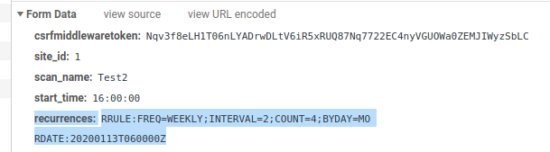

# Scantron API Client

A Python API client for interacting with the Scantron console.  For Create/Retrieve/Update/Delete functions, a Python
`requests` object is returned with the standard `requests` attributes:

```python
import scantron_api_client

sc = scantron_api_client.ScantronClient()
engine_id = 3
response = sc.retrieve_engine(engine_id)

print(response.status_code)
print(response.json())
```

For functions to query **all** values from an endpoint, a JSON dictionary is returned:

```python
sites = sc.retrieve_sites()
```

## Installation

```python
git clone https://github.com/rackerlabs/scantron.git
cd scantron_api_client
virtualenv -p python3 .venv  # If using a virtual environment.
source .venv/bin/activate  # If using a virtual environment.
pip install -r requirements.txt
```

## Update Credentials

Update the `scantron_api_secrets.json` file with the host, port, and API key for an admin / superuser.  The token should
be 40 characters.

```json
{
    "host": "scantron-console.mydomain.com",
    "port": 443,
    "token": "7a4d...b388"
}
```

## Usage

Instantiate the client.

```python
import scantron_api_client
sc = scantron_api_client.ScantronClient()
```

### Retrieve all sites

```python
sites = sc.retrieve_sites()
```

### Create a scan command

```python
payload = {
  "scan_binary": "nmap",
  "scan_command_name": "Top 20 TCP",
  "scan_command": "--top-ports 20 -sV -n -Pn --open",
}

response = sc.create_scan_command(payload)
print(response.status_code)
print(response.json())
```

### Retrieve all engines

```python
engines = sc.retrieve_engines()
```

### Create a site

It requires the Scan Command ID and Scan Engine ID.

```python
payload = {
  "site_name": "DMZ",
  "description": "DMZ Assets",
  "targets": "192.168.1.1/24 fw1.example.com",
  "excluded_targets": "192.168.1.100",
  "scan_command": 1,
  "scan_engine": 1,
  "email_scan_alerts": True,
  "email_alert_addresses": "alice@example.com,bob@example.com",
}

response = sc.create_site(payload)
print(response.status_code)
print(response.json())
```

### Create a scan

The `recurrences` value can be tricky.  If you are using a complicated one, open developer tools in your browser, create
the scan through the web GUI, and inspect the POST request.  Note there is a newline (`\n`) between `RRULE` and `RDATE`.
At a minimum, you need to include `RDATE:`.



```python
payload = {
    "site": 1,
    "scan_name": "DMZ Scan",
    "enable_scan": True,
    "start_time": "16:00:00",
    "recurrences": "RRULE:FREQ=WEEKLY;BYDAY=MO\nRDATE:20200113T060000Z",
}

response = sc.create_scan(payload)
print(response.status_code)
print(response.json())
```

### Retrieve scan results

Requires the scan ID.

```python

scans = sc.retrieve_scans()

nmap_scan_results = sc.retrieve_scan_results(1, "nmap")
xml_scan_results = sc.retrieve_scan_results(1, "xml")
json_scan_results = sc.retrieve_scan_results(3, "json")
```
